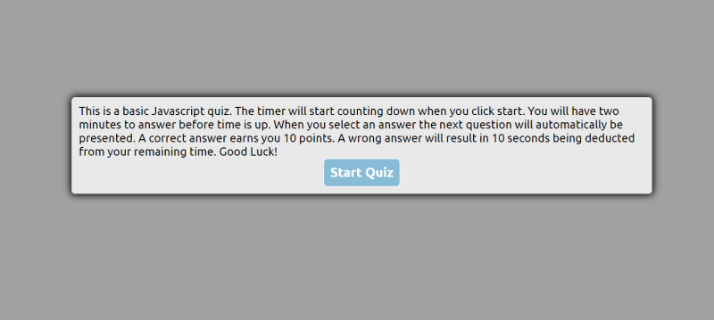
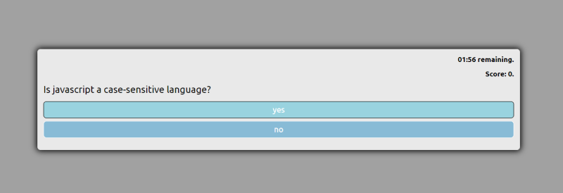
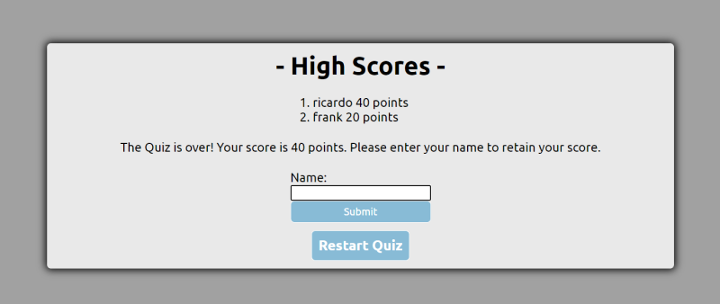

# [Javascript Quiz](https://chopsushi206.github.io/JavascriptQuiz/)

## Acceptance Criteria

```
GIVEN I am taking a code quiz
WHEN I click the start button
THEN a timer starts and I am presented with a question
WHEN I answer a question
THEN I am presented with another question
WHEN I answer a question incorrectly
THEN time is subtracted from the clock
WHEN all questions are answered or the timer reaches 0
THEN the game is over
WHEN the game is over
THEN I can save my initials and my score
```

## Development

Started by creating repo and foundational files and directories. 
Created basic CSS stylings for a page. Decided to place Quiz and all interactivity within a card.
Added some css for rounded corners and dropshadows. Also add a class to hide certain areas ofthe page when not being used.

Once buttons for the page were styled and class to hide things was created, started coding some basic javascript to hide the start button when quiz was started. 

Quiz questions were placed in an array, and each question is an object containing the actual question as well as answers, and values for whether the answer is true or false.

At this time began to work on the function to display a timer once the start button had been clicked. Intervals were defined in seconds. Had difficulty throughout development of the app getting the timer to reset. Was however able to ge tthe timer to display in minutes:seconds format.

Also added a section to display when the quiz was over. All of these elements were called by their IDs and set to hide until the function called the DOM Element within the function. This was done by adding and removing class called hidden, which applied Dispay None in the css file.

Within the ShowQuestion function I created an element and used that to display the answer from question object. Then appended all of these within the AnswersEl of the DOM.

At this point of the App, a next button was coded to display when a User selected an answer option. This was affecting the usability of the App, as the user could select multiple answers before moving to the next question, so it was eventually removed, and recoded to simply reset the question and show the next one when a user selects an answer. 

It was around this time I added html elements for the score to appear below the timer as well. The variable was declared globally and intially set to 0. It was programmed to add 10 points when the user selects the right answer. Was able to hide the Questions area of the HTML and show the QuizOver section when the countdown = 0.

Added a restart button to show at the end of the quiz where High Scores and user input is displayed. Completely separate function written to reset score as well as exclude hiding the start button which was included in the start quiz function initially.

Also added an if statement that decrements the timer 10 seconds if the user selects wrong answer to a question. Also added a separate endQuiz function to include a lot of the parameters to display when time runs out or all questions answered.

it was at this point the quiz portion was pretty functional and so then concentrated on defining an array to store all high scores in local sotrage and render them in the page afterwards, completing the application.


## Screenshots







---

## Resources

[Google Fonts](https://fonts.google.com/) For fontstyle Unbuntu was used.

## Developer


 Coding and repository done by [Li Hua Anderson](https://github.com/chopsushi206).

[Email](mailto:lihua.anderson@gmail.com) | [LinkedIn](https://linkedin.com/in/li-hua-anderson-b259b7144)
